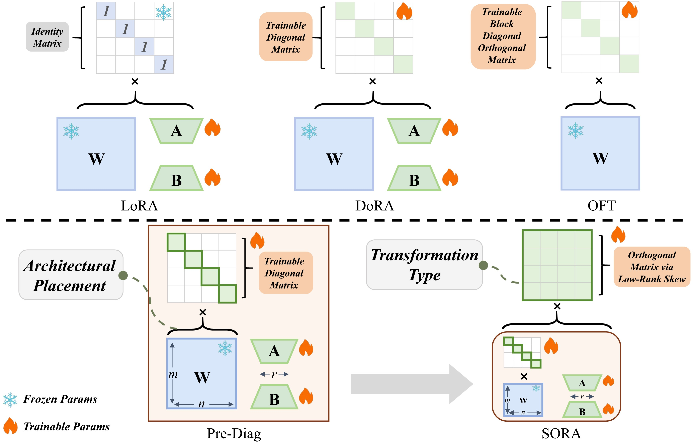

<p align="right">
  <a href="./README.md" title="English"></a>
</p>

# Calibrating and Rotating: A Unified Framework for Weight Conditioning in PEFT

Authors: Da Chang, Peng Xue, Yu Li, Yongxiang Liu, Pengxiang Xu, Shixun Zhang

[Arxiv 链接](https://arxiv.org/pdf/2511.00051)

### SORA

SORA方法对DoRA进行改进，并引入了OFT的思想。最近NeurIPS 2025 Spotlight的同期工作[RidgeLoRA](https://openreview.net/pdf?id=0RF80tUWuv)与我们的**Pre-Diag**以及**SORA**具有相似之处，感兴趣的朋友可以进一步参考！

我们的 SORA 位于 `peft/tuners/sora/layer.py`。



### 用法

如需复现，请运行

```sh
bash scripts/train_and_eval.sh <adapter_name> <lr> <num_epochs> <rank> <rp> <dataset>
```

```python
export TASK_NAME=mrpc

python run_glue.py \
  --model_name_or_path google-bert/bert-base-cased \
  --task_name $TASK_NAME \
  --do_train \
  --do_eval \
  --max_seq_length 128 \
  --per_device_train_batch_size 32 \
  --learning_rate 4e-4 \
  --num_train_epochs 5 \
  --adapter_name $ADAPTER_NAME /
  --lora_rank 16 \
  --lora_alpha 32 \
  --r_p 4 \
  --output_dir /tmp/$TASK_NAME/
```

如需运行 checkpoints 的评估，请运行

```sh
bash scripts/eval.sh /path/to/adapter/dir <task> meta-llama/Meta-Llama-3-8B
```

如需在 MetaMathQA 上训练 Gemma-7B，请使用以下命令启动该过程：

```sh
bash run_math.sh
```

**请注意，LLaMA3-8B 和 Gemma-7B 的实验是在 8x Ascend 910C NPU 上进行的。要迁移到 NVIDIA GPU，您需要将 `npu` 更改为 `cuda`。**

如需在数学测试基准上测试 Gemma-7B，请使用以下命令启动该过程：

```sh
bash eval_math.sh
```

**请注意，您需要根据您的本地路径配置训练数据集、测试数据集、基础模型路径和适配器路径。**

## 结果

Gemma-7B 在 MethMathQA-14k 上进行了微调，并在 GSM8K、MultiArith、AQuA、SVAMP、AddSub 和 SingleEq 上进行了评估。我们报告了在 $\{2e-4, 4e-4, 6e-6\}$ 学习率范围内的最佳性能。(硬件: 8x Ascend 910C)。

| 方法 | 可训练参数 % | GSM8K | MultiArith | AQuA | SVAMP | AddSub | SingleEq | 平均值 |
| --- | --- | --- | --- | --- | --- | --- | --- | --- |
| OFT/2e-4 | 0.58 | 73.09 | **99.00** | 38.19 | 75.00 | 86.10 | 94.69 | 77.68 |
| LoRA+/2e-4 | 0.40 | 74.83 | *98.67* | 36.58 | 75.10 | 85.32 | 93.11 | 77.27 |
| LoRA/4e-4 | 0.40 | 74.07 | 97.50 | 37.80 | 75.90 | 85.08 | *95.85* | 77.70 |
| DoRA/4e-4 | 0.41 | 73.77 | 97.17 | *38.34* | **77.80** | **88.40** | 93.92 | 78.23 |
| SORA/4e-4 | 0.47 | **74.98** | 98.50 | **40.49** | *76.30* | *87.63* | **95.87** | **78.96** |


### 致谢

  * 我们的代码取自 [https://github.com/kcc-lion/polar](https://github.com/kcc-lion/polar) 。

  * **GLUE 基准测试**数据**可从** [https://huggingface.co/datasets/nyu-mll/glue](https://huggingface.co/datasets/nyu-mll/glue) **获取**。

  * **Commonsense 基准测试**数据**可从** [https://github.com/gkevinyen5418/LoRA-RITE](https://github.com/gkevinyen5418/LoRA-RITE) **获取**。

  * `finetune_commonsense.py` 脚本最初改自 [https://github.com/tloen/alpaca-lora/blob/main/finetune.py](https://github.com/tloen/alpaca-lora/blob/main/finetune.py)。

  * lm-evaluation-harness 取自 [https://github.com/EleutherAI/lm-evaluation-harness](https://github.com/EleutherAI/lm-evaluation-harness)。

  * 可编辑的 PEFT 版本基于 [https://github.com/huggingface/peft](https://github.com/huggingface/peft) 的 v0.14.1.dev0。

  * `run_glue.py` 脚本改自 [https://github.com/huggingface/transformers/blob/main/examples/pytorch/text-classification/run\_glue.py](https://github.com/huggingface/transformers/blob/main/examples/pytorch/text-classification/run_glue.py)。